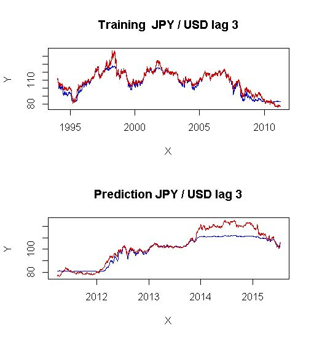

[](http://quantlet.de/index.php?p=info)

## [](http://quantlet.de/) **SFEnnjpyusd** [](http://quantlet.de/d3/ia)

```yaml

Name of QuantLet : SFEnnjpyusd 

Published in: Statistics of Financial Markets

Description: 'Shows the forecasting of the exchange rate time series JPY/USD using RBF (radial basis function) neural networks considering 3 periods of time dependency. 80% of data is taken as training set and 20% as validation set.'

Keywords: approximation, data visualization, exchange-rate, financial, forecast, graphical representation, neural-network, plot, rbf, time-series, visualization

Author: SFEwise2016.Group9

Submitted: Wed, July 20 2016 by quantomas

Datafiles: dat.csv

Example: 'Plots the real exchange rate JPY/USD (red) versus its approximation through RBF neural network (blue): training set(above) and forecasts(below).'

```




```r
rm(list=ls(all=TRUE))
graphics.off()

################################ SUBROUTINES ################################

rbftrain = function(x,y,clusters,learn,epochs,mMSE,activ){
# RBFTRAIN    trains a radial basis function neural network
#
# ---------------------------------------------------------------------
# Usage       {inp,net,err} = rbftrain(x,y,clusters,learn,epochs,mMSE{,activ})
# ---------------------------------------------------------------------
# Input       
# Parameter   x
# Definition  (n x p) matrix, predictor variables
# Parameter   y
# Definition  (n x q) matrix, response variables
# Parameter   clusters
# Definition  scalar, number of clusters to be built in the hidden layer
# Parameter   learn
# Definition  (3 x 1) vector, minimum learning rate and maximum learning rate
#             for building the clusters respectively, learn[3] is the learning
#             rate for training the output layer. learn must be from (0,1)
# Parameter   epochs
# Definition  (2 x 1) vector, number of epochs to train the cluster and output
#             units respectively
# Parameter   mMSE
# Definition  scalar, minimum value of the mean squared error to stop the training
# Parameter   activ
# Definition  optional scalar, 0 for binary (default) or 1 for bipolar activation sigmoid function.
# ---------------------------------------------------------------------
